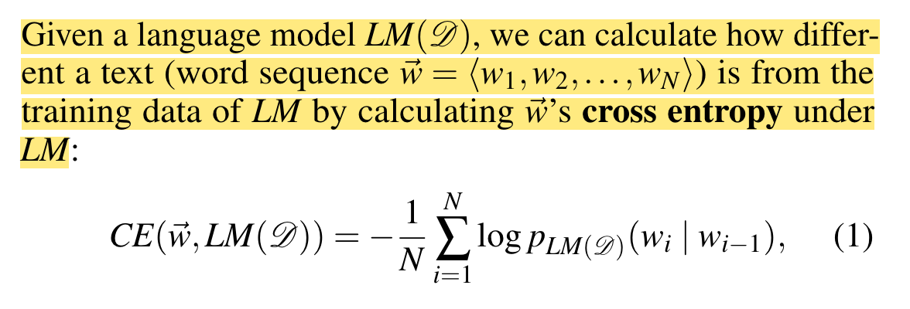

# reading notes

Generally:

- We want a way of comparing two samples of language
- Approaches:
    - Can look at distributions of word use and compare them
    - Can build a n-gram language model for one sample, then predict probability of the other
    
    
    
    - Can calculate word embeddings for each sample and compare individual words via cosine
    - Classification-based
        - Train and classifier to recognize text from a community
        - See how well it does on new text.
    - Distributions of special words or LIWC measures

---

### Explain like I am a Scientist: The Linguistic Barriers of Entry to r/science

classification-based

Seems like this didn’t work well.

### Language use as a reflection of socialization in online communities

Old. But very much aligned with us.

They use breast cancer.org

Look at individual change over time. For first year of participation

I think comparing distributions of word use over time.

### Community Identity and User Engagement in a Multi-Community Landscape

They use very simple measure of specificity and volatility of language within a community to characterize 300 reddit communities. They also relate it to retention

### Characterizing the Language of Online Communities and its Relation to Community Reception

They want to represent style. Seems useful.

Building language models using some combination of words and/or POS tags.

“All language models are trigrams trained using the SRILM toolkit”

These style models are potentially useful. They can provide measures of distance

### Characterizing English Variation across Social Media Communities with BERT

They use Zhang’s specificity metric

Jensen-Shannon divergence (like Kullback–Leibler divergence)

Some Bert-based methods

### Unsupervised discovery of non-trivial similarities between online communities

distinct word embedding model 𝐸𝑐 is learned for each community

Another approach: Compare word embeddings

### No Country for Old Members: User Lifecycle and Linguistic Change in Online Communities

“p’s cross-entropy according to the snapshot language model SLMm(p) of the month m(p) in which the post was uttered; we write this as H(p, SLMm(p))= 1 Ni  log PSLMm(p) (bi),”

this uses bigram language models

### Norms Matter: Contrasting Social Support Around Behavior Change in Online Weight Loss Communities

this is about caring two communities;

Some measures look at prominent words

tfidf measures

Word embedding methods

### Mental Health Support and its Relationship to Linguistic Accommodation in Online Communities

See linguistic style matching

## Read about n-gram language models

### ** Chapter 6 from Manning and Schutz

### In [nltk](https://www.nltk.org/api/nltk.lm.html)

## Read about Word embeddings

## word2vec

---

### ****The Language of Online Intercultural Community Formation****

Looks like simple analyses. Some manual coding. Some word frequency

### Computational Measures for Language Similarity across Time in Online Communities

Quote old

Spearman’s Correlation Coefficient, Zipping and Latent Semantic Analysis

Zipping method is unusual

LSA method is just comparing blocks of text.

### Quick, Community-Specific Learning: How Distinctive Toxicity Norms Are Maintained in Political Subreddits

Perspective

Jigsaw Perspective API (Wulczyn, Thain, and Dixon 2017) to identify toxic comments

---
